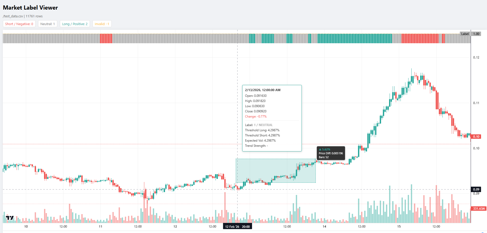
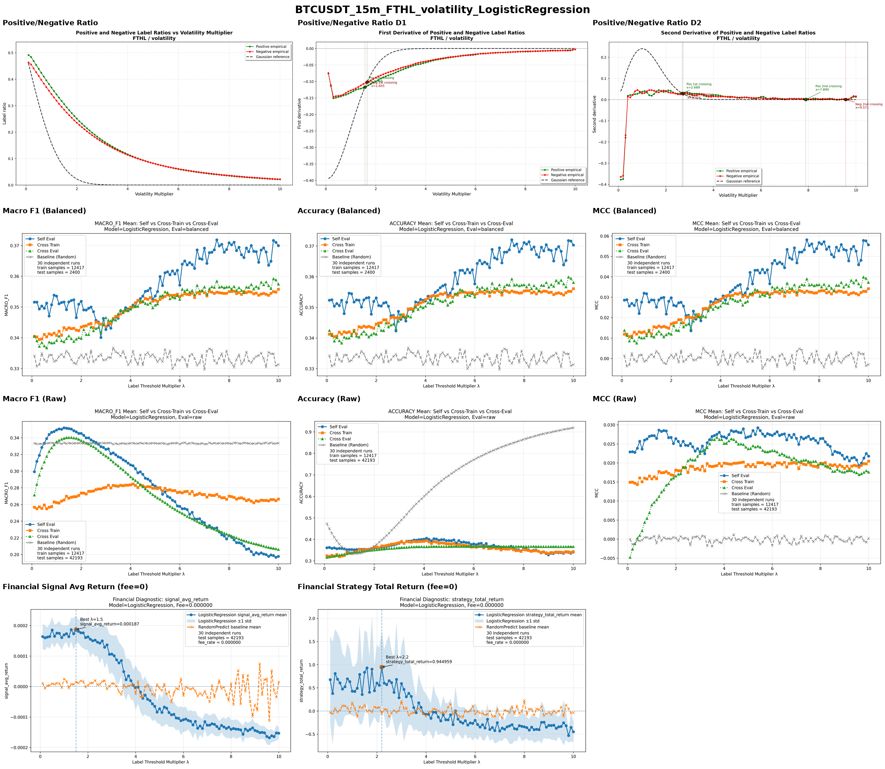
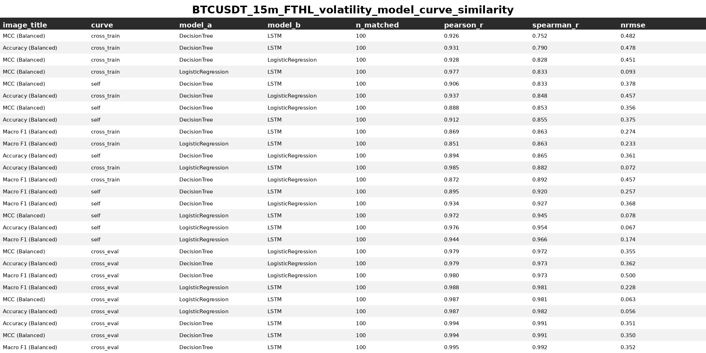

# Financial Label Parameters Effect

This repository contains the code and experimental outputs for the dissertation:

**Parameterized Labeling and Induced Sample Distribution Regimes in Financial Time Series**

The project investigates how parameter choices in financial labeling methods affect:

- label proportions;
- machine-learning performance;
- cross-parameter generalisation;
- financial returns.

The experiments use **Fixed-Time Horizon Labeling (FTHL)** and the **Triple-Barrier Method (TBM)**. The volatility multiplier and prediction horizon are varied independently under a controlled experimental framework. Logistic Regression, Decision Tree, and LSTM models are evaluated on BTCUSDT and XAUUSD datasets.

## Research Overview

The main analysis examines whether changes in label structure are associated with changes in downstream model performance. Label proportions generated from empirical market data are also compared with those generated from a Gaussian random-walk reference.

The results show that labeling parameters systematically change the induced class distribution and learning task. However, no stable correlation is observed between label-distribution structure and machine-learning performance. Improvements in classification metrics also do not necessarily correspond to higher financial returns.

A cross-model curve-similarity analysis is used to verify whether the evaluated models respond similarly to labeling-parameter variation. Logistic Regression is selected as the representative model because it has the highest mean cross-model similarity and the lowest variation across experiments.

## Example Results

### Label Viewer

The label viewer displays generated labels together with market prices, thresholds, and other labeling details. It is useful for validating and debugging the labeling process.

<p align="left">

</p>

### Representative Experimental Report

The composed report combines label-distribution, machine-learning-performance, and financial-return results over the same parameter range.

<p align="left">

</p>

### Cross-Model Curve Similarity

The curve-similarity analysis compares parameter-dependent performance patterns across Logistic Regression, Decision Tree, and LSTM using Spearman rank correlation.

<p align="left">

</p>

## Project Structure

```text
financial-label-parameters-effect/
├── analysis/                 # Result analysis and report generation
├── data_process/             # Data preparation and labeling
│   └── label_viewer/         # Optional web-based label inspection tool
├── figures/                  # Figures used in this README
├── model/                    # Model training and evaluation
└── README.md
```

## Label Visualization (Optional)

An optional web-based tool is provided for inspecting generated labels together with market prices, thresholds, and other labeling details.

Before starting the viewer, make sure the following setting is enabled in `data_process/common.py`:

```python
CONF_DF = "to_csv"
```

Then run:

```bash
cd data_process/label_viewer
npm install
npm run dev
```

## Experimental Design

The main experimental dimensions are:

- **Datasets:** BTCUSDT 15-minute, XAUUSD 15-minute, and XAUUSD daily;
- **Labeling methods:** FTHL and TBM;
- **Parameters:** volatility multiplier and prediction horizon;
- **Models:** Logistic Regression, Decision Tree, and LSTM;
- **Classification metrics:** accuracy, macro F1-score, and MCC;
- **Evaluation settings:** self-evaluation, cross-training, and cross-evaluation;
- **Financial measures:** average signal return and total strategy return.

The XAUUSD daily dataset is retained for label-proportion analysis but excluded from the main machine-learning comparison because the balanced samples are too limited for reliable evaluation.

## Main Findings

1. Labeling parameters systematically alter positive, neutral, and negative class proportions.
2. No stable correlation is identified between label-distribution structure and machine-learning performance.
3. Volatility-multiplier variation can produce broader performance turning regions, while increasing the prediction horizon generally reduces performance.
4. Classification improvements do not necessarily produce better financial returns.
5. Empirical exploration across a plausible labeling-parameter range remains reasonable in practical financial machine learning.

## Notes

This repository is primarily a research codebase created for dissertation experiments. Paths, configuration values, and execution scripts may need to be adjusted for a different local environment or dataset.
